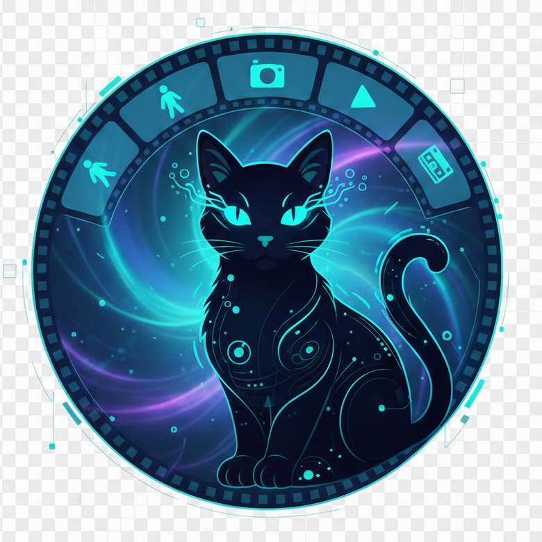
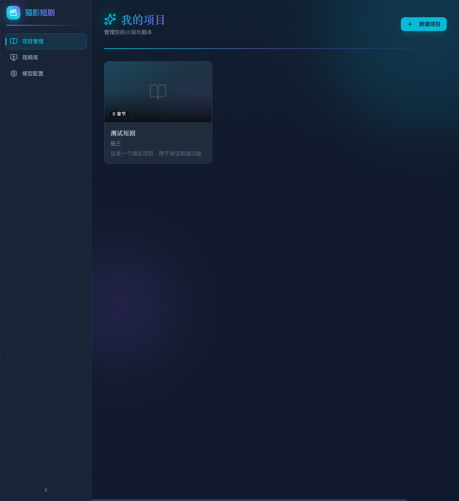
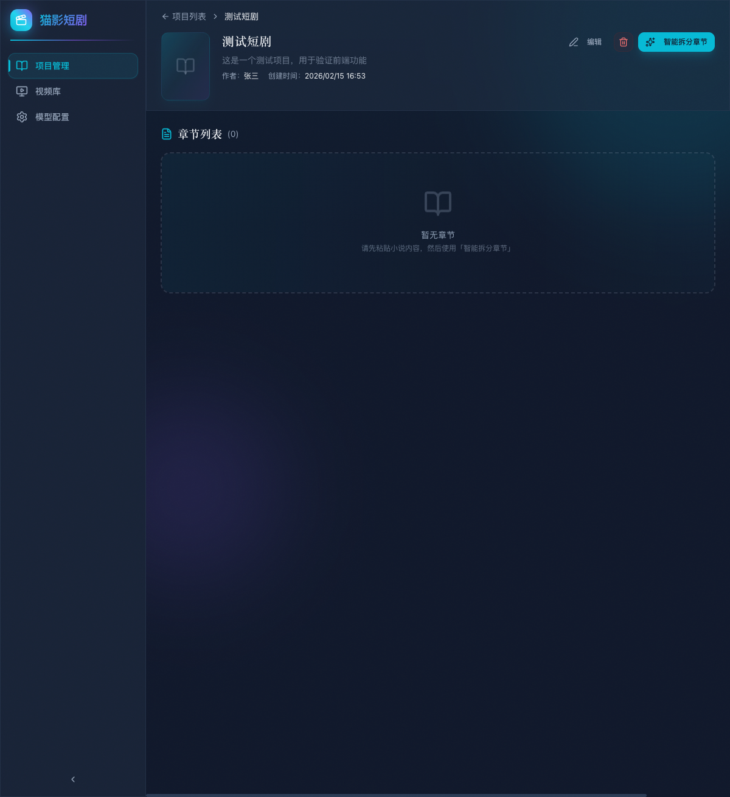
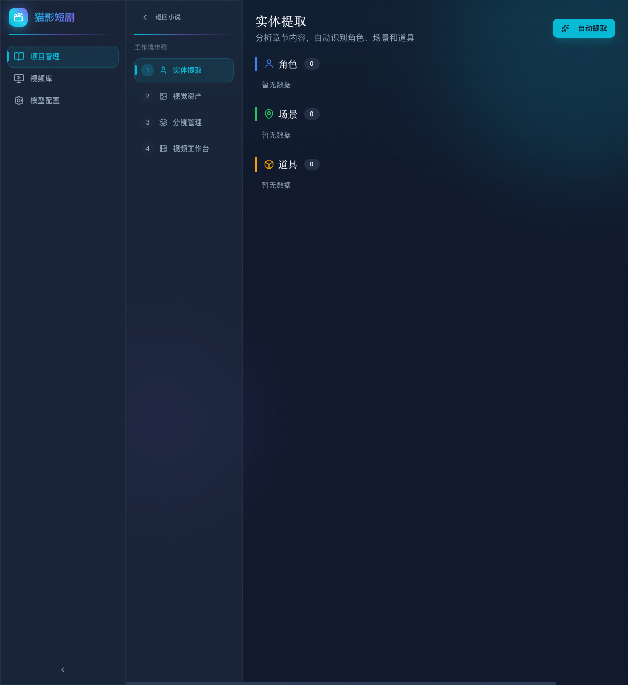
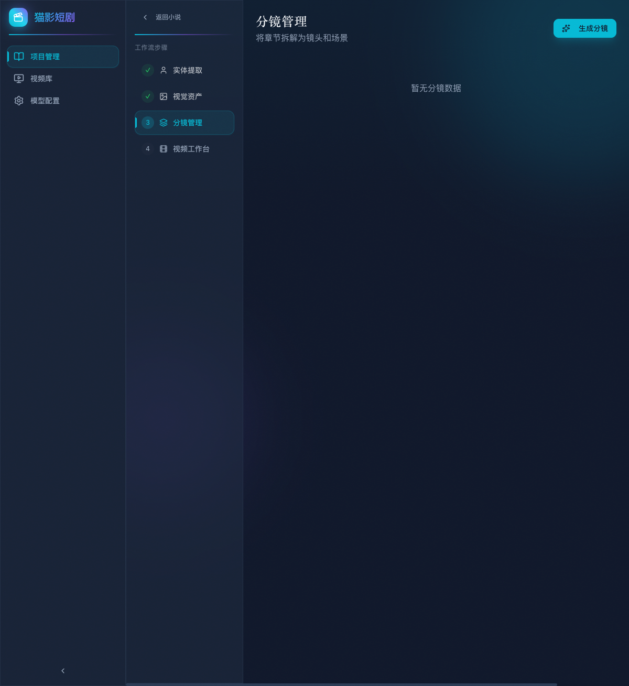
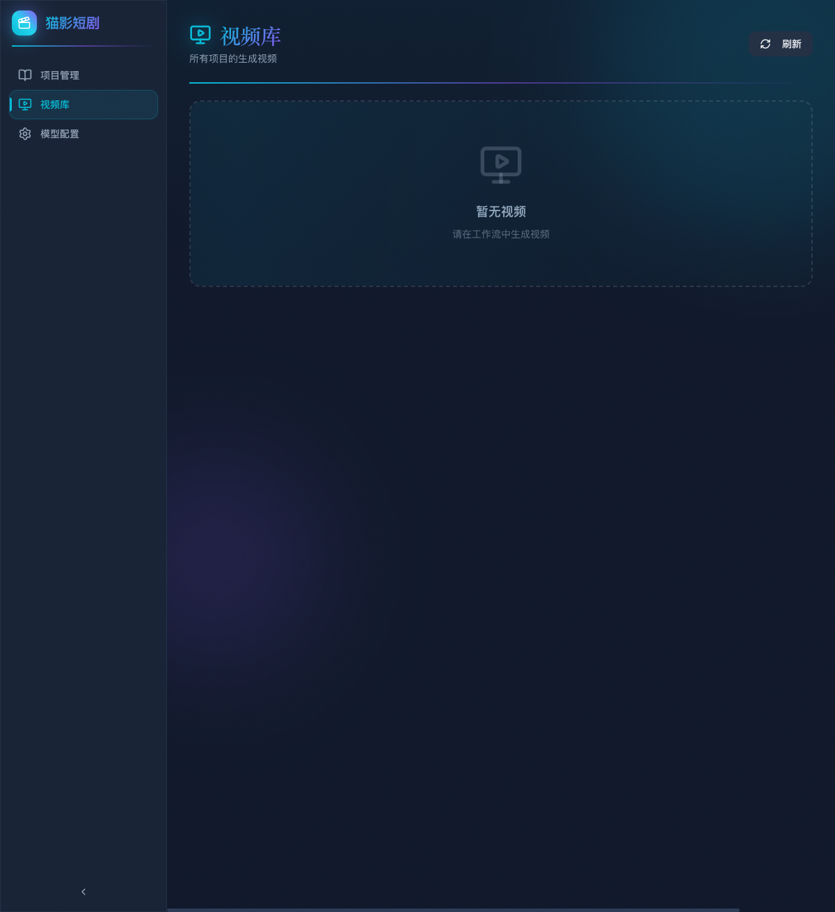
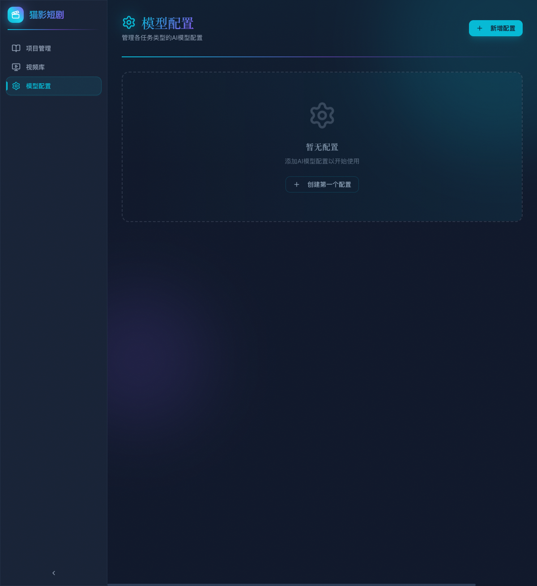

<p align="center">
  
</p>

<h1 align="center">猫影短剧</h1>

<p align="center">
  <strong>「 AI 驱动的小说转短剧全流程生产平台 」</strong>
</p>

<p align="center">
  
  
  
  
  
</p>

<p align="center">
  <a href="#核心功能">核心功能</a> &bull;
  <a href="#界面预览">界面预览</a> &bull;
  <a href="#快速开始">快速开始</a> &bull;
  <a href="#项目结构">项目结构</a> &bull;
  <a href="#技术栈">技术栈</a> &bull;
  <a href="#测试驱动">测试驱动</a> &bull;
  <a href="#开发指南">开发指南</a>
</p>

---

## 介绍

**猫影短剧** 是一个完整的 AI 驱动小说转短剧生产平台。从小说文本输入到最终视频输出，覆盖 **章节拆分 → 实体提取 → 参考图生成 → 分镜生成 → 视频合成** 全流程。

本项目不是一个 demo 或 proof-of-concept。它拥有完善的工程架构、严格的分层设计、全面的测试覆盖，是一个可直接投入生产的工业级应用。

## 核心功能

### 小说管理
- 小说录入与元数据管理（名称、作者、简介、封面）
- **AI 智能章节拆分** —— 自动识别章节边界，一键拆分长篇小说
- 章节级别的工作流状态追踪

### AI 工作流引擎
每个章节拥有独立的四步工作流，环环相扣：

| 步骤 | 功能 | 说明 |
|:---:|------|------|
| **1** | 实体提取 | AI 分析章节内容，自动提取角色、场景、道具等实体 |
| **2** | 资产管理 | 管理提取的实体资产，AI 生成角色/场景参考图 |
| **3** | 分镜生成 | AI 将章节内容转化为分镜脚本，生成每个镜头的提示词 |
| **4** | 视频合成 | 基于分镜和参考图，调用视频生成模型生成短剧片段 |

### 多模型支持
- 灵活的 AI 模型配置系统，支持多任务类型独立配置
- 每种任务类型（文本生成、图像生成、视频生成）可配置不同模型
- 模型热切换 —— 一键激活/停用，无需重启

### 视频库
- 全局视频管理，查看所有项目的生成视频
- 实时状态追踪（排队中/处理中/已完成/失败）
- 支持视频预览与批量管理

## 界面预览

<table>
  <tr>
    <td align="center"><b>项目管理</b></td>
    <td align="center"><b>小说详情</b></td>
  </tr>
  <tr>
    <td></td>
    <td></td>
  </tr>
  <tr>
    <td align="center"><b>AI 工作流</b></td>
    <td align="center"><b>分镜生成</b></td>
  </tr>
  <tr>
    <td></td>
    <td></td>
  </tr>
  <tr>
    <td align="center"><b>视频库</b></td>
    <td align="center"><b>模型配置</b></td>
  </tr>
  <tr>
    <td></td>
    <td></td>
  </tr>
</table>

## 快速开始

### 环境要求

- Python 3.12+
- Node.js 20+
- SQLite（开发环境）/ PostgreSQL（生产环境）

### 后端启动

```bash
# 克隆项目
git clone https://github.com/Anning01/novelvids.git
cd novelvids

# 安装依赖（推荐使用 uv）
uv sync

# 启动后端服务
uvicorn novelvids.app:app --reload --port 8000
```

### 前端启动

```bash
cd web

# 安装前端依赖
npm install

# 启动开发服务器（自动代理到后端 8000 端口）
npm run dev
```

访问 `http://localhost:3000` 即可使用。

## 项目结构

```
novelvids/
├── api/                    # API 路由层 —— RESTful 接口定义
│   ├── novel.py            # 小说相关 API
│   ├── chapter.py          # 章节相关 API
│   ├── scene.py            # 分镜相关 API
│   ├── video.py            # 视频相关 API
│   ├── asset.py            # 资产相关 API
│   ├── config.py           # 模型配置 API
│   └── ai_task.py          # AI 任务查询 API
│
├── controllers/            # 业务控制层 —— 核心业务逻辑
│   ├── novel.py
│   ├── chapter.py
│   ├── scene.py
│   ├── video.py
│   ├── asset.py
│   └── config.py
│
├── models/                 # 数据模型层 —— Tortoise ORM 模型
│   ├── _base.py            # 基础模型（审计字段、软删除）
│   ├── novel.py
│   ├── chapter.py
│   ├── scene.py
│   ├── video.py
│   ├── asset.py
│   └── config.py
│
├── schemas/                # 数据校验层 —— Pydantic Schemas
│   ├── _base.py            # 通用分页、响应结构
│   └── ...
│
├── services/               # AI 服务层 —— LLM/图像/视频模型调用
│   ├── ai_task_executor.py # AI 任务调度执行器
│   ├── extraction/         # 实体提取服务
│   ├── storyboard/         # 分镜生成服务
│   ├── reference/          # 参考图生成服务
│   ├── video/              # 视频生成服务
│   └── nlp/                # NLP 工具
│
├── prompts/                # Prompt 模板 —— AI 提示词管理
│
├── test/                   # 测试套件 —— 四层全覆盖
│   ├── conftest.py         # 测试夹具（内存数据库、模拟客户端）
│   ├── test_api/           # API 集成测试
│   ├── test_controllers/   # Controller 单元测试
│   ├── test_models/        # Model 单元测试
│   └── test_services/      # Service 单元测试
│
├── web/                    # 前端应用 —— React 19 + TypeScript
│   ├── pages/              # 页面组件
│   │   ├── Dashboard.tsx   # 项目管理首页
│   │   ├── NovelDetail.tsx # 小说详情页
│   │   ├── Videos.tsx      # 视频库
│   │   ├── Config.tsx      # 模型配置
│   │   └── workflow/       # 四步工作流页面
│   ├── components/         # 通用组件
│   │   ├── Layout.tsx      # 全局布局（侧边栏导航）
│   │   └── ui/             # shadcn/ui 组件库
│   ├── services/           # API 调用层
│   └── types.ts            # TypeScript 类型定义
│
├── novelvids/              # 应用入口与配置
├── pyproject.toml          # Python 项目配置
└── docs/                   # 项目文档与截图
```

## 技术栈

### 后端

| 技术 | 用途 |
|------|------|
| **FastAPI** | 高性能异步 Web 框架 |
| **Tortoise ORM** | 异步 ORM，支持 SQLite / PostgreSQL |
| **Pydantic** | 数据校验与序列化 |
| **OpenAI SDK** | AI 模型统一调用接口 |
| **Uvicorn** | ASGI 服务器 |

### 前端

| 技术 | 用途 |
|------|------|
| **React 19** | UI 框架 |
| **TypeScript** | 类型安全 |
| **Vite** | 构建工具 |
| **Tailwind CSS** | 原子化样式 |
| **shadcn/ui** | UI 组件库 |
| **React Router** | 路由管理 |

## 测试驱动

本项目采用严格的测试驱动开发（TDD）流程，测试覆盖后端四层架构的每一层：

```
test/
├── test_api/               # 8 个 API 集成测试模块
│   ├── test_novel_api.py
│   ├── test_chapter_api.py
│   ├── test_scene_api.py
│   ├── test_video_api.py
│   ├── test_asset_api.py
│   ├── test_config_api.py
│   ├── test_extraction_api.py
│   └── test_file_api.py
│
├── test_controllers/       # 7 个 Controller 测试模块
├── test_models/            # Model 测试
└── test_services/          # 3 个 Service 测试模块
```

运行测试：

```bash
# 运行全部测试（含覆盖率报告）
pytest

# 测试覆盖范围：models, controllers, api
# 配置见 pyproject.toml [tool.pytest.ini_options]
```

pytest 已配置自动覆盖率报告（`--cov=models --cov=controllers --cov=api --cov-report=term-missing`），确保每次提交都能看到覆盖率变化。

## 开发指南

### 后端开发规范

项目遵循严格的 **四层架构**，职责清晰分离：

```
API 层 (api/)
  ↓ 参数校验、路由
Controller 层 (controllers/)
  ↓ 业务逻辑编排
Model 层 (models/)
  ↓ 数据存取
Service 层 (services/)
  ↓ 外部 AI 模型调用
```

- **API 层**：只负责 HTTP 参数解析和响应格式化，不包含业务逻辑
- **Controller 层**：业务逻辑的核心，协调 Model 和 Service
- **Model 层**：纯数据操作，不依赖 HTTP 上下文
- **Service 层**：封装所有外部 AI 调用，可独立测试和替换

### 前端开发规范

```bash
cd web

# 开发
npm run dev

# 类型检查
npx tsc --noEmit

# 生产构建
npm run build
```

---

<p align="center">
  <sub>Built with passion by <a href="https://github.com/Anning01">Anning</a></sub>
</p>
