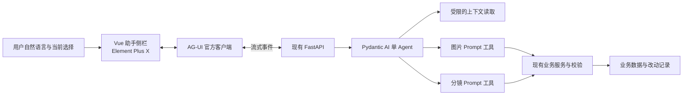

# 创作 Agent 接入调研

调研日期：2026-09-04。依据当前仓库代码、项目官方文档和公开包元数据；未安装依赖、未调用付费模型、未进行运行时兼容性或效果测试。本文是选型与接入建议。

后续已确定 Pydantic AI + AG-UI + Element Plus X。开发以[创作助手设计约定](superpowers/specs/2026-09-04-creation-agent-design.md)、[分阶段计划](superpowers/plans/2026-09-04-creation-agent-phased-plan.md)和[验收矩阵](superpowers/verification/2026-09-04-creation-agent-acceptance.md)为准；本文保留为调研记录。后续代码核实发现共享分镜渲染器已具备独立“镜头1”和资产描述展开能力，必须优先复用，不能照本文的概括性建议另建一套渲染实现。

## 建议采用的组合

**Pydantic AI + AG-UI + Element Plus X，复用现有 FastAPI、Vue 3、Pinia 和业务服务。**

一个创作 Agent 贯穿项目、资产、分镜页面。用户用自然语言描述效果，Agent 读取项目上下文，选择工具，生成或修改 Prompt，接收校验和保存结果，再说明完成情况。只开放图片 Prompt 和分镜 Prompt 两类写入能力。

“全程辅助”指上下文和对话贯穿创作流程，不代表自动获得全流程执行权限。现有书稿分析、资产提取和生成任务继续承担原有职责；Agent 不因为能聊天就自动接管这些任务。

## 当前代码与接入位置

| 当前实现 | 发现 | 对接建议 |
| --- | --- | --- |
| `web/src/pages/ShortDramaAgentPage.vue` | 主要展示项目分析结果、编辑内容和轮询任务 | 增加贯穿页面的创作助手入口，不以替换此页面作为 Agent 接入的全部工作 |
| `services/project_analysis/handler.py` | 固定执行书稿理解、人物入库、封面生成 | 保留既有流程，不直接作为 Agent 的任意可调用工具 |
| `services/storyboard/generator.py` | 按章节分块请求结构化输出，并支持截断后拆分重试 | 可复用上下文和模板能力；现有循环是生成流程控制，不是对话驱动的工具选择循环 |
| `services/llm/json_output.py` | 调用 Chat Completions、解析 JSON、Pydantic 校验 | 继续服务既有任务；Agent 自身由框架管理工具调用消息和执行循环 |
| `models/asset.py` | `base_traits` 已定义为最终发送的完整生图提示词 | 图片 Prompt 的现成持久化落点；变体应按现有变体模型映射 |
| `models/scene.py` | 同时存在 `prompt`、`prompt_params`、`description` | 分镜 Prompt 更新必须明确这些字段的关系，避免结构化内容与最终文本互相矛盾 |
| `schemas/workbench.py` | 已声明 `asset_prompt`、`shot_prompt` 两类编辑入口 | 与用户提出的两类能力相符，复用现有画布绑定，不新增核心画布实现 |
| `schemas/scene.py`、`controllers/scene.py` | 通用 ScenePatch 可修改多种字段，但未提供专用的结构化 Prompt 更新契约 | 增加窄化的 Prompt 更新入口，不能直接将通用 CRUD 暴露给模型 |
| `models/config.py`、`schemas/config.py` | 已有结构化 JSON 能力配置；本次检查未发现对应的工具调用能力字段 | 工具调用需独立声明并验证，不能用“支持 JSON”代替 |
| `api/scene.py` | 当前团队、角色和资源权限检查主要在 API 入口执行 | Agent 直接调用业务对象时也必须复用权限校验，不能假定 Controller 自带完整鉴权 |

## 后端框架比较

| 候选 | 已核实能力 | 对本项目的判断 |
| --- | --- | --- |
| **Pydantic AI** | Python、类型化工具和依赖、消息历史、调用限制、AG-UI/FastAPI 适配；核心 MIT | **首选**。已有 FastAPI/Pydantic，工具范围小，能集中精力实现业务约束 |
| **LangGraph** | 有状态 Agent 编排、检查点、暂停恢复；核心 MIT | 适合需要跨阶段恢复、复杂分支和长任务的系统。本期仅两类 Prompt 操作，不优先引入显式图编排 |
| **Agno** | Python Agent 框架及 AgentOS 平台方向；当前仓库许可证为 Apache-2.0 | 可作为备选；本项目已有后端和工作台，没有明显理由同时引入平台层 |

这是按当前范围作出的适配判断，不是性能排名。来源：[Pydantic AI 仓库](https://github.com/pydantic/pydantic-ai)、[Agent 与运行限制](https://pydantic.dev/docs/ai/core-concepts/agent/)、[LangGraph 仓库](https://github.com/langchain-ai/langgraph)、[LangGraph 暂停恢复](https://docs.langchain.com/oss/python/langgraph/interrupts)、[Agno 仓库](https://github.com/agno-agi/agno)、[Agno 许可证](https://github.com/agno-agi/agno/blob/main/LICENSE)。

Pydantic AI 的 OpenAIProvider 可以使用自定义地址或已有 AsyncOpenAI 客户端。因此可以继续使用后台配置的模型服务；但 OpenAI-compatible 只说明接口形态，仍需验证工具参数、工具结果回传和流式事件是否兼容。模型 ID、能力和服务地址继续由后台配置决定，不在 Agent 中硬编码供应商分支。[模型适配文档](https://pydantic.dev/docs/ai/models/openai/)

框架开源与模型开源是两件事。先选框架，不在未做中文创作和工具调用实测前指定某个模型。候选模型至少要通过多轮工具调用、中文改写、引用保留和范围遵循测试；需要读取生成图时再要求视觉输入能力。

## 前端组件比较

| 候选 | 可复用部分 | 接入成本与选择 |
| --- | --- | --- |
| **Element Plus X**（`vue-element-plus-x`） | 消息气泡、会话列表、输入框、附件和执行状态类组件；MIT | **首选**。通过 AG-UI 客户端连接 Python，只补消息映射、改动卡片和工作台刷新。当前项目没有 Element Plus，需要新增并按需使用 |
| **CopilotKit Vue**（`@copilotkit/vue`） | 官方 Vue Provider、Chat、Sidebar、工具渲染及上下文组合函数 | 更完整的整套接入备选；要接受 Runtime 部署方式并核对功能授权边界 |
| **AI Elements Vue** | 对话、消息、工具确认等组件，基于 shadcn-vue；Apache-2.0 | 视觉定制能力强，但需要 Tailwind/shadcn-vue；组件源代码进入仓库后也由项目维护。本项目目前不具备这套基础，优先级较低 |

来源：[Element Plus X 仓库与组件演示入口](https://github.com/element-plus-x/Element-Plus-X)、[CopilotKit Vue 官方参考](https://docs.copilotkit.ai/reference/vue)、[AI Elements Vue 仓库及安装前提](https://github.com/vuepont/ai-elements-vue)、[AI Elements Vue 许可证](https://github.com/vuepont/ai-elements-vue/blob/main/LICENSE)。

Element Plus X 是社区 AI 组件项目，不能把它当成 Element Plus 官方团队的支持承诺。AI Elements Vue 也是独立 Vue 项目，不等于 Vercel 对 Vue 的官方组件支持。

### CopilotKit 需要特别区分的接入方式

截至调研日，官方已有 Vue SDK，不能沿用“仅支持 React”的判断。Vue 快速开始通过 Copilot Runtime 接入；该运行层会在现有 Python 后端之外增加 JS 服务部署或相应运行环境。[Vue 快速开始](https://docs.copilotkit.ai/vue)

官方文档明确：生产直连选项 `selfManagedAgents` 属于 Enterprise Intelligence；`agents__unsafe_dev_only` 只面向开发。不能将开发直连示例当作无额外条件的生产方案。[自管 Agent 接入说明](https://docs.copilotkit.ai/backend/self-managed-agents)

这不意味着使用 CopilotKit 必须购买云服务。其开源 Runtime 支持 AG-UI 集成；由应用自行保存和恢复历史也有开源路线。CopilotKit 提供的托管持久化、实时跨端同步等属于另一层能力。[开源与 Intelligence 边界](https://docs.copilotkit.ai/concepts/oss-vs-enterprise)

因此：如果愿意增加 Runtime，希望更多前端行为由整套 SDK 承担，可以选 CopilotKit Vue；如果坚持现有 Python 服务结构和较小的部署面，采用 Element Plus X + AG-UI 更直接。

## 最小架构

Pydantic AI 官方提供 AGUIAdapter，将 FastAPI 请求转换为 Agent 运行并返回流式响应。AG-UI 的官方 JS HttpAgent 负责请求、事件订阅和 HTTP 中止，省去自定义流协议及底层解析。Element Plus X 负责组件表现；它不会自动理解本项目的工具结果，需要一层 Vue/Pinia 适配。[Python 适配](https://pydantic.dev/docs/ai/integrations/ui/ag-ui/)、[AG-UI HttpAgent](https://docs.ag-ui.com/sdk/js/client/http-agent)

使用标准库解决 Agent 循环、流式传输和聊天组件；本项目仍需实现上下文加载、业务写入、权限约束和版本记录。这些与领域有关，不可能靠换一个聊天库自动完成。

## 两类操作的明确边界

建议对模型只注册两个写工具：`update_image_prompt`、`update_storyboard_prompt`。两者均可接受当前授权范围内的多个目标，用同一种能力完成批量操作。工具输入使用专门的 Pydantic Schema，拒绝额外字段。

| 项目 | 默认范围 |
| --- | --- |
| 可读取 | 当前项目摘要、相关章节、角色/场景信息、已有 Prompt、被引用的素材及选中目标；按需加载 |
| 图片写入 | 当前目标的生图 Prompt，包括空 Prompt 的首次填充；保持人物身份、引用和既有素材绑定 |
| 分镜写入 | 当前镜头的画面描述、动作、光线、运镜等 Prompt 内容；维护允许修改的结构化参数及最终文本一致 |
| 批量修改 | 用户说“这几个镜头”或“本章”时解析为可验证的目标集合；不能自行扩展到其他章节 |
| 本期不开放 | 原文、项目结构、资产身份、分镜新增/删除/重排、模型配置、参考关系、数字人/音频操作、媒体生成和发布 |
| 全局模板 | 项目内的实例 Prompt 可改；代码中 `prompts/` 的 system/user 模板不向产品 Agent 开放 |

读取是支持上述两类操作的辅助能力，不是新增业务写权限。不要开放数据库工具、任意 HTTP 请求、文件系统、浏览器控制或通用 `patch_resource` 工具。

用户已经要求将两类 Prompt 交给 Agent：范围明确时直接保存，反馈差异并提供撤销，不逐条弹确认。只有目标不明确、请求超出范围或与已锁定设定冲突时才澄清。撤销由应用的版本恢复功能执行，不需要再给模型一个通用写工具。

改变 Prompt 不等于重新生成图片或视频。用户可以继续使用已有生成入口；“自动反复生成直到满意”会增加生成权限和费用控制，本期不包含。

## 如何做到像协作创作一样使用

用户选中三个镜头，说：“这一段更压抑一些，少一点花哨运镜，人物外貌保持一致。”

助手读取当前章节、选中镜头和相关角色，检查已有描述，调用分镜 Prompt 工具。后端校验通过后保存，并返回真实更新结果。界面显示“已调整 3 个镜头的光线与运镜”，可展开查看差异、定位镜头或撤销。用户继续说“第二个再克制一点”，助手能够指向上次操作中的第二个目标。

用户不需要复制粘贴或手动改 Prompt。对话完成状态必须由保存结果驱动，不能模型回复“改好了”就视为成功。执行状态展示“读取上下文 / 修改 / 已保存”等实际事件，不以长篇思考过程代替结果。

建议采用工作台侧栏，保留当前资产或镜头为主视图；助手显示当前作用范围、消息、简短操作状态、改动卡片与撤销。跨页面保持会话，发出请求时固定当前选择，避免切换页面改变正在执行的目标。

## 必须落实的业务约束

1. **服务器确定范围。** 团队和用户身份来自现有登录上下文；项目、章节及目标 ID 必须重新校验。客户端状态、聊天历史和模型生成的 ID 都不能充当授权依据。底层适配器支持前端工具也不代表本项目应接受任意前端工具。
2. **分镜一致性。** 结构化镜头沿用现有格式化规则重建最终 Prompt，并同步相关字段。历史纯文本镜头走明确的兼容路径；不能为了改一句文字无依据重建整份参数或丢失旧数据。
3. **版本与幂等。** 记录修改前后值、目标版本、会话/运行/工具调用标识。同一调用重试不能重复修改；执行期间发现目标被改动时拒绝覆盖，重新读取。批量工具按一次操作提交事务，避免静默半成功。
4. **撤销保留后续工作。** 只恢复本次操作的字段；如果字段后来又被修改，需要先解决冲突，不能回滚整个资产或镜头对象。
5. **循环有上限。** 设置模型请求数、工具调用数和超时限制；校验失败允许有限纠正。限值以后端配置为准，框架计价不能替代项目自身的定价配置。[Pydantic AI 运行限制](https://pydantic.dev/docs/ai/core-concepts/agent/)
6. **会话持续但不无限堆积。** 保存服务端消息、工具结果、运行状态及必要摘要；每轮读取最新业务内容。首次只需项目/章节级上下文和按需查询，没有必要预先引入向量数据库。Pydantic AI 支持消息序列化，但数据库、会话隔离和摘要策略仍由应用负责。[消息历史](https://pydantic.dev/docs/ai/core-concepts/message-history/)
7. **中断结果可核对。** 前端断开 HTTP 不等于已提交的数据库修改被撤销。服务器需要在下一次模型调用或写入前检查取消状态，重连后恢复实际运行结果。不要让用户因断网重复提交同一操作。
8. **现有生成结果保持可追溯。** 修改 Prompt 后提示现有图片/视频仍对应旧版本；不自动删除媒体或触发重新生成。

## 实施顺序与验收

第一步：做不写业务库的接入验证。用项目现有配置方式接入候选模型，验证 Pydantic AI 的两类工具调用、AG-UI 流式事件，以及 Element Plus X 在当前 Vue/Vite/TypeScript 下的消息与状态展示。不得把依赖声明满足等同于集成测试通过。

第二步：接入两个窄化工具与改动记录。复用资产 Prompt、分镜格式化、语言规则及参考引用逻辑；新增模板集中放在 `prompts/`。接口输入、输出、错误码和前端刷新同步设计。

第三步：让会话贯穿现有页面，增加目标范围、改动卡片、撤销与恢复。沿用画布既有数据映射，检查与 shengshimedia 的共享实现兼容。

建议以以下场景验收：

- 连续两轮修改同一对象，无需用户编辑 Prompt，数据库和界面结果一致。
- 两种工具都能首次填充空 Prompt，也能修改已有内容。
- 用户只要求当前镜头，其他镜头和其他字段均不变。
- 批量调整角色相关画面时保留身份、引用标记和既有素材关系。
- 请求删除章节、修改模型或自动出视频时，不发生对应操作。
- 同一工具调用重复投递不重复写入；并发修改不被覆盖；撤销不覆盖后续变更。
- 校验失败、模型超时、断网和取消后显示真实状态，不错误报告成功。
- 新数据表初始化、旧数据兼容及重复启动通过；现有生成流程、引用关系和画布相关回归通过。
- 后端相关 pytest，以及前端相关测试、类型检查和构建通过。

根据项目 AGENTS.md，涉及鉴权、数据迁移或外部计费逻辑的具体实现方案应标记“需人工审核”。尤其 Agent 会产生多轮模型调用，应在实现前明确如何复用现有用量记录与计费入口，而非从新流式接口绕过。本文不修改这些逻辑，也不将本次调研视为依赖与锁文件变更授权。

## 版本核查快照与未验证项

以下是调研时公开仓库返回的 latest 元数据，不是建议直接安装 latest：

| 包 | 查询结果 | 声明的兼容范围 |
| --- | --- | --- |
| `pydantic-ai` | 2.39.0，MIT | Python >=3.10，覆盖本项目 Python 3.12 |
| `vue-element-plus-x` | 2.0.3，MIT | Vue ^3.5.17、Element Plus ^2.9.7；当前 Vue 声明满足，但需要新增 Element Plus |
| `@ag-ui/client` | 0.0.59，MIT | JS 客户端，需与 Python AG-UI 适配版本验证 |
| `@copilotkit/vue` | 1.70.1，包元数据标记 MIT | Vue >=3.3.0；具体功能授权不能仅依据这个包字段判断 |

来源：[PyPI 元数据](https://pypi.org/pypi/pydantic-ai/json)、[Element Plus X 元数据](https://registry.npmjs.org/vue-element-plus-x/latest)、[AG-UI 元数据](https://registry.npmjs.org/@ag-ui/client/latest)、[CopilotKit Vue 元数据](https://registry.npmjs.org/@copilotkit/vue/latest)。

尚未验证：本项目实际模型的工具调用成功率、中文创作质量、端到端延迟、包体积、全局样式冲突和完整依赖解析。需要通过第一步接入验证后再确定固定版本。当前文档与发行版也可能存在差异，编码应以选定版本的 API 为准。
